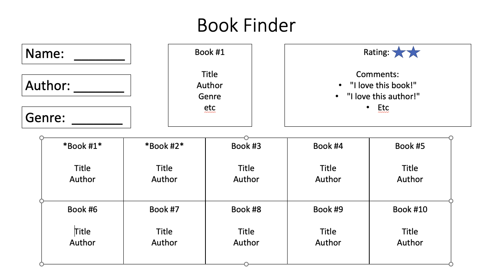

#random-activity-generator

- HTML/CSS/JS frontend
    - accesses from public API ([https://mixedanalytics.com/blog/list-actually-free-open-no-auth-needed-apis/](https://mixedanalytics.com/blog/list-actually-free-open-no-auth-needed-apis/)) or db.json using json-server
    - API or json should return collection of >5 objects, 3 attributes
    - handled async, use json as communication format
- runs on single page — no redirect/reload (1 HTML file)
- 3 different event listeners (different types)
    - search/filter, toggle light/dark, upvoting posts (each has unique callback function using .addEventListener())
    - events embedded into HTML/CSS do not count
- 1 instance of array iteration (map, forEach, filter, etc)

Project Pitch:
Our project aims to lets get ideas for random activities. They can do this by clicking the "random" button or searching using a series of different identifiers including: type, number of participants, price (with range), and accessibility (with range).

Features we'd like to include:
-allows users to search with a variety of queries 
-renders mystery cards which will reveal details on click
-mouseover/hover will trigger blur effect?? TBD

Outline for web page: 